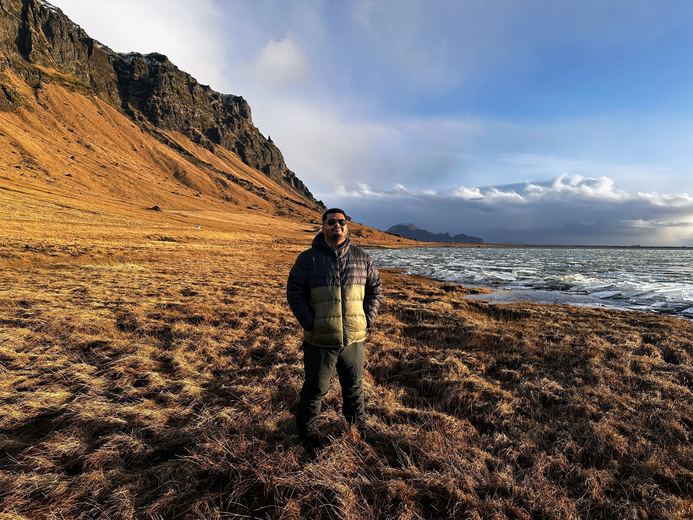
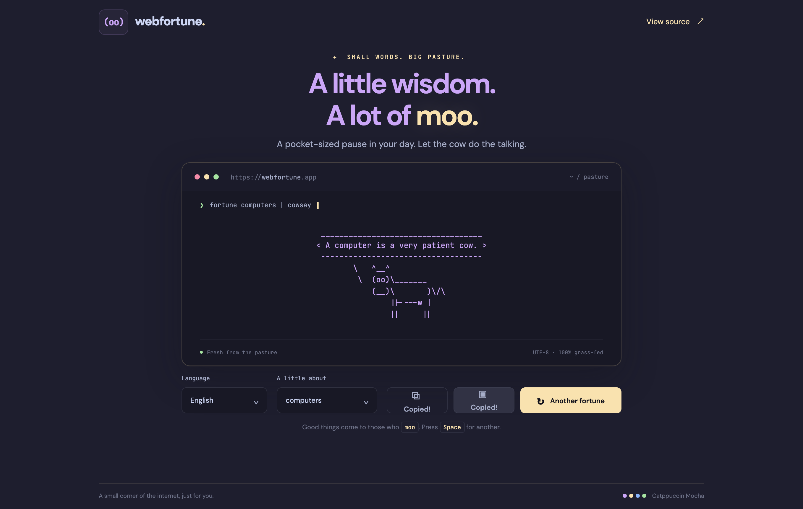
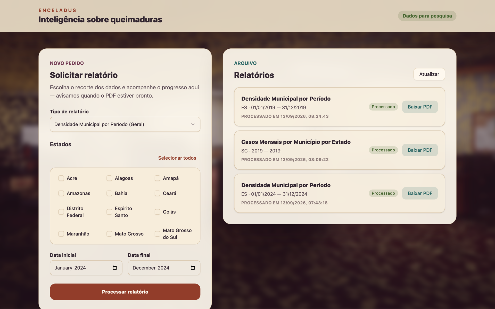

  

<h1 align="center">Hi, I'm Rodrigo 👋</h1>

  <strong>Web, mobile, and desktop developer based in Braga, Portugal.</strong> 
  I build polished interfaces, dependable APIs, and cloud-native products from end to end.

  <a href="https://github.com/rodrinac?tab=repositories">Projects</a>
  ·
  <a href="https://webfortune.app/">Webfortune</a>
  ·
  <a href="https://rodrinac.github.io/enceladus">Enceladus</a>
  ·
  <a href="https://github.com/rodrinac/cinemaclub">Cinema Club</a>

## Featured work

### [Webfortune](https://github.com/rodrinac/webfortune) 🐮

A multilingual fortune API and playful cowsay-inspired web experience. Rust powers the backend, while the responsive Catppuccin interface is deployed through AWS and GitHub Pages.

  

`Rust` · `JavaScript` · `Vite` · `Playwright` · `AWS Lambda` · `Terraform`

### [Enceladus](https://github.com/rodrinac/enceladus) 🪐

Burn-data reporting for researchers at the Brazilian Burn Society (SBQ). A Next.js interface requests reports from a Go API, with statistical processing in R turning raw DataSUS data into downloadable PDFs. The static export is live on GitHub Pages.

  

`Next.js` · `TypeScript` · `Tailwind CSS` · `Go` · `R` · `AWS`

### [Cinema Club](https://github.com/rodrinac/cinemaclub) 🎬

A cozy movie-discovery app built with React Native and Expo. It runs across mobile and web, with a secure AWS API layer between the client and TMDB.

  

`React Native` · `Expo` · `TypeScript` · `AWS Lambda` · `API Gateway` · `Terraform`

## What I work with

  
  
  
  
  
  

## A little about me

- I enjoy taking products from a rough idea to a production-ready experience.
- I care about thoughtful UX, maintainable code, testing, and reliable delivery.
- When I'm away from a keyboard, there is a fair chance I'm looking for a new landscape to explore.

  Thanks for stopping by — have a look around ✨

